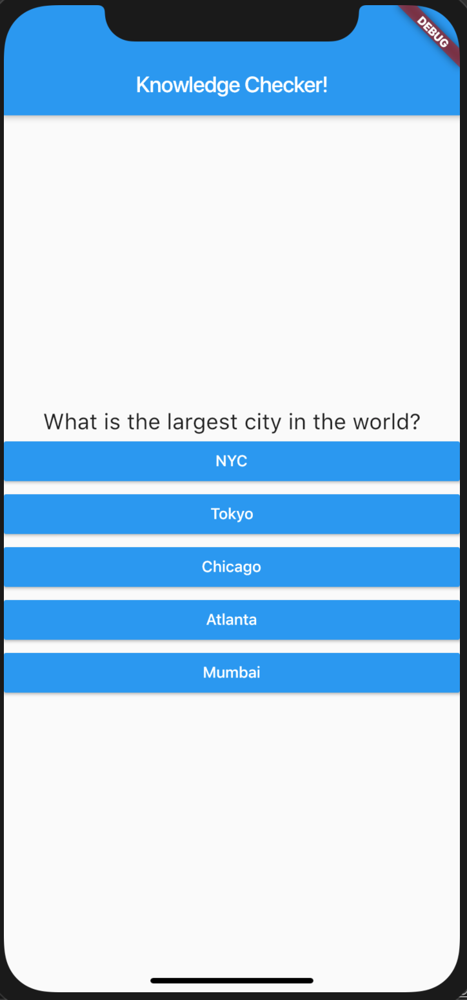
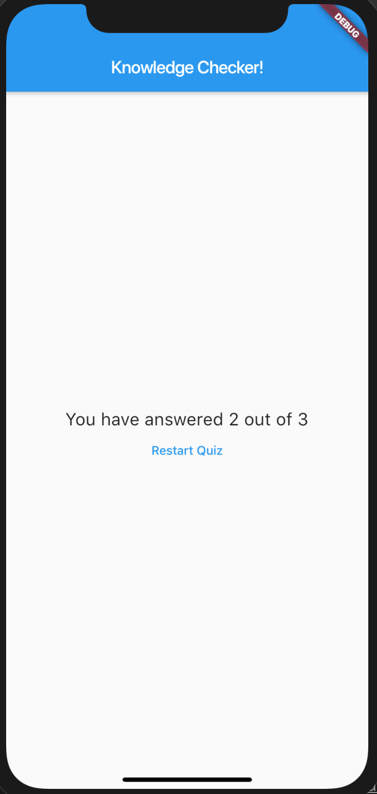
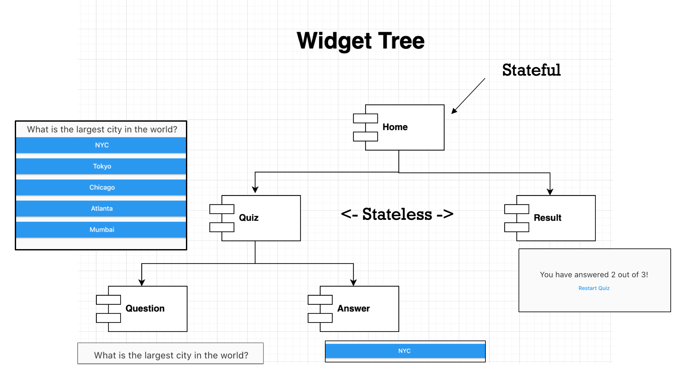

# Knowledge Checker App
A sample flutter app that is structured as follows.

## Getting Started
The App has the following basic flow.

### Main Screen (Users to answer multiple questions)

### Result Screen (Showing final result)

## Design / Widget Tree
Widgets Tree is designed as follows.

